# Hi, I'm Shabi 👋

Computer Science student who enjoys building things, solving problems, and understanding how systems work.

Currently exploring **Python, C++, Linux, AI, automation, and backend development.**

---

## 📈 Learning Journey

```mermaid
flowchart LR
    A["🌱 Foundations"] --> B["💻 Programming"]
    B --> C["🧠 DSA"]
    C --> D["🛠️ Projects"]
    D --> E["🐧 Linux"]
    E --> F["⚙️ Backend"]
    F --> G["☁️ Cloud"]
    G --> H["🤖 AI"]
    H --> I["🚀 Open Source"]

    style A fill:#161b22,stroke:#58a6ff,color:#fff
    style B fill:#161b22,stroke:#58a6ff,color:#fff
    style C fill:#161b22,stroke:#58a6ff,color:#fff
    style D fill:#161b22,stroke:#58a6ff,color:#fff
    style E fill:#161b22,stroke:#58a6ff,color:#fff
    style F fill:#161b22,stroke:#58a6ff,color:#fff
    style G fill:#161b22,stroke:#58a6ff,color:#fff
    style H fill:#161b22,stroke:#58a6ff,color:#fff
    style I fill:#161b22,stroke:#58a6ff,color:#fff
```

**Current →** `DSA` · `Python` · `Linux` · `Google Cloud Arcade` · `AI`

---

## 🧰 Tech

`Python` `C++` `Bash` `Linux` `Git` `GitHub` `JavaScript` `TypeScript`

---

## 🔗 Connect

  
  &nbsp;&nbsp;
  
  &nbsp;&nbsp;
  
  &nbsp;&nbsp;
  

------

## Experienced With

  

  <i>Build → Learn → Improve</i>

